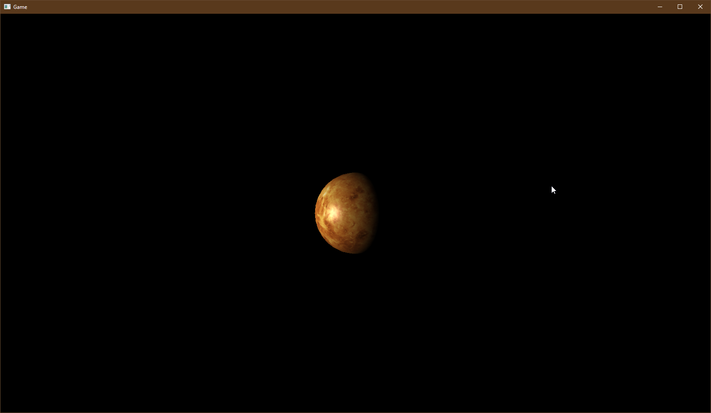

# TinyEngine

TinyEngine is a single header game engine implementation project inspired by the OLC Game engines.

## Venus Demo

This demo uses the default shader and textures from [Solar System Scope](https://www.solarsystemscope.com/textures/) which are free which is wicked!

