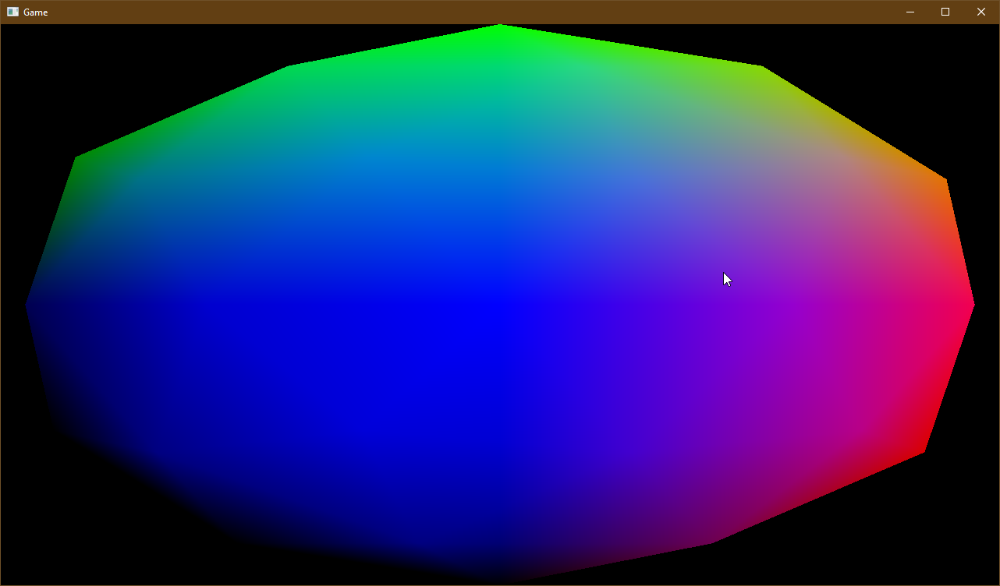

# TinyEngine

TinyEngine is a single header game engine implementation project inspired by the OLC Game engines.

Here's an OBJ file containing a sphere:

Currently there's no cameras and other useful stuff like that...

It'll come.
