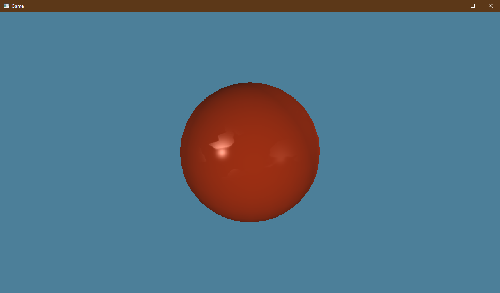

# TinyEngine

TinyEngine is a single header game engine implementation project inspired by the OLC Game engines.

New Thing: Blinn Phong lighting and Diffuse/Specular texture maps!

## Note:
The default shaders are currently separate from the header but will eventually be bundled into it in some form so that you only need one header for the engine to work.